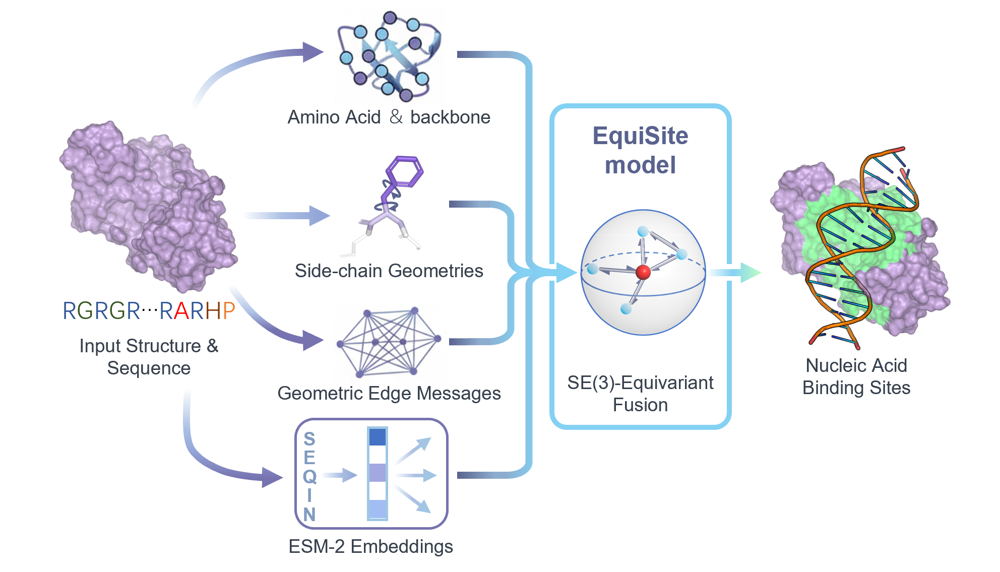

# EquiSite: Multi-Scale Equivariant Graph Learning for Robust Nucleic Acid Binding Site Prediction

[](https://doi.org/10.5281/zenodo.XXXXXXX)
[](https://opensource.org/licenses/MIT)

This is the official PyTorch implementation of **EquiSite**.

**EquiSite** is an SE(3)-equivariant geometric graph neural network for accurate protein-DNA and protein-RNA binding site prediction. EquiSite explicitly models **multi-scale protein geometry** (including atomic side-chain orientations) and **eliminates the need for computationally expensive evolutionary profiles (MSAs)**.

EquiSite achieves state-of-the-art performance on both experimental structures and AlphaFold2-predicted models, and supports structure-guided molecular docking (e.g., HADDOCK3)

### Graphical Abstract




---

## Installation

We recommend using Anaconda to manage the environment.

```bash
conda env create -f conda_env.yml
conda activate equisite
```

Core dependencies include:

- Python >= 3.9
- PyTorch
- PyTorch Geometric
- ESM (facebookresearch/esm)
- h5py
- numpy
- scikit-learn


---

## Training

Example training command:

```bash
python train.py \
    --dataset RNA_Fix \
    --dataset_path dataset/ \
    --epochs 200 \
    --batch_size 4 \
    --eval_batch_size 2 \
    --hidden_channels 128 \
    --num_blocks 4 \
    --cutoff 11.5 \
    --level allatom+esm
```

Training logs and checkpoints will be saved automatically under:

```
./saves/
```

The best model (based on validation ROC-AUC) is saved as:

```
best.pt
```

---

## Inference (PDB → Binding Probabilities)

EquiSite supports end-to-end inference from raw PDB files.

Example:

```bash
python infer.py \
    --model_path path/to/best.pt \
    --pdb_dir path/to/pdb_folder \
    --out_dir output_directory \
    --device 0
```

For each input structure:

- A per-residue binding probability file (`.out`) is generated
- Runtime statistics are saved in `runtime.csv`

---

## Reproducing Manuscript Results

To reproduce the main results:

1. Download pretrained checkpoints from Zenodo.
2. Place the checkpoint file in a local directory.
3. Run evaluation using `infer.py` or the evaluation logic in `train.py`.
4. Compare generated outputs with archived result files.

All evaluation outputs reported in the manuscript are archived in the Zenodo release.

---

## Data

Datasets used in this study are derived from previously published benchmark collections.  
Please refer to the manuscript for detailed dataset construction and preprocessing procedures.

This repository contains data processing utilities but does not redistribute raw third-party datasets.

---

## 📄 License

This project is released under the MIT License.

---
